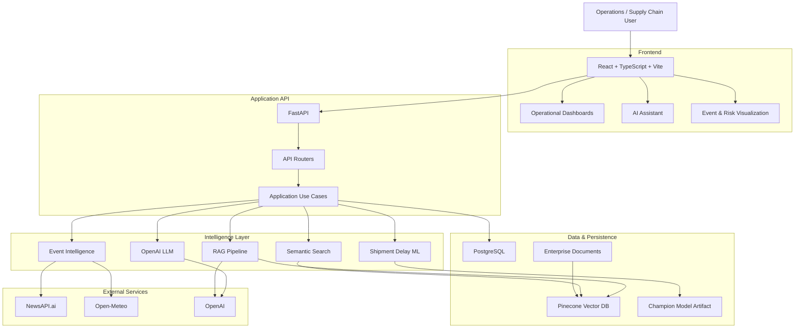
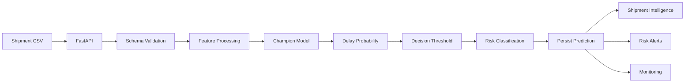
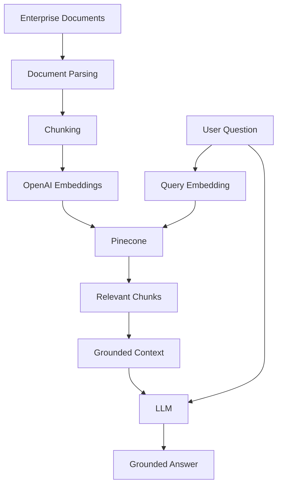
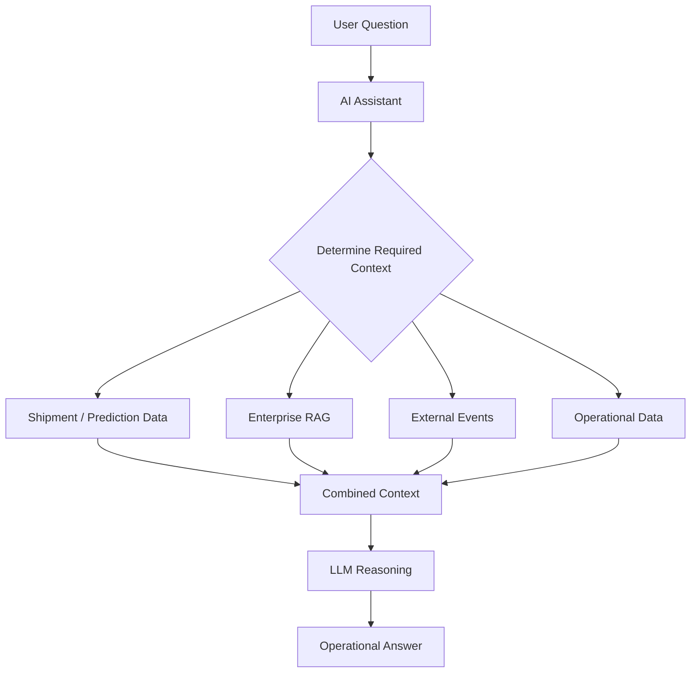
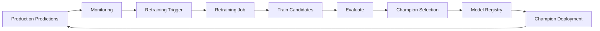
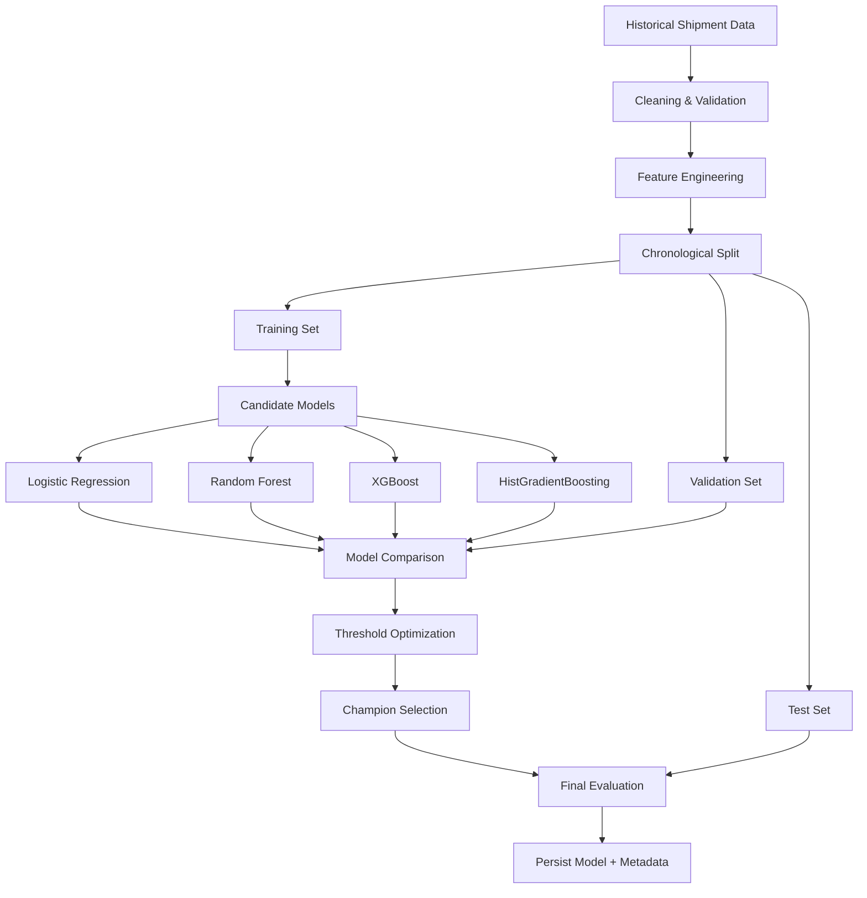
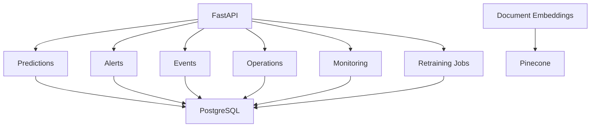
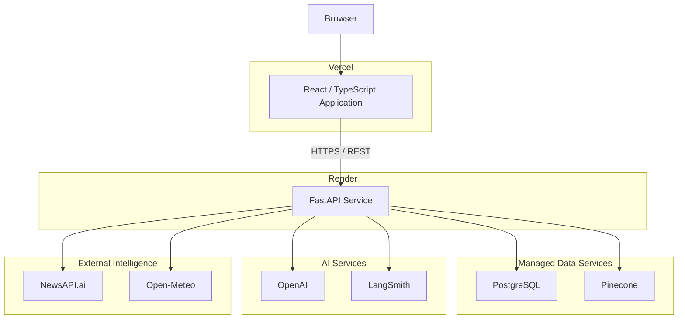

# SupplyMind AI

**AI-powered supply-chain operational intelligence for predicting shipment delays, identifying disruption risks, retrieving enterprise knowledge, and supporting operational decisions.**

[Live Application](YOUR_VERCEL_PRODUCTION_URL) · [API Documentation](YOUR_RENDER_BACKEND_URL/docs) · [Graduation Presentation](https://docs.google.com/presentation/d/1Ipx4UM9lsbN_yZLIATiBXl_kcN-oYmSLTChGX8ZOIHo/) · [GitHub Repository](YOUR_GITHUB_REPOSITORY_URL)

---

## Overview

SupplyMind AI is an end-to-end AI Engineering project designed to answer a practical supply-chain question:

> **Can we identify shipment risks early enough for an operations team to take action before they become customer problems?**

The project combines classical machine learning, generative AI, Retrieval-Augmented Generation (RAG), semantic search, external disruption intelligence, weather information, operational monitoring, and a full-stack web application.

It was developed as my graduation project for the **Ironhack AI Engineering program**.

The objective was not simply to train a machine-learning model in a notebook. SupplyMind was designed as a complete AI product around the model:

```text
Operational Data
       ↓
Machine Learning
       ↓
Risk Prediction
       ↓
External Context
       ↓
Enterprise Knowledge
       ↓
AI-Assisted Investigation
       ↓
Operational Action
       ↓
Monitoring & Retraining
```

---

# Why I Built SupplyMind

The project was inspired by logistics and operational challenges I encountered during my previous engineering leadership experience.

In businesses such as meal-kit delivery, a late shipment is more than a logistics KPI. A delayed food box can affect product quality, customer experience, refunds, support workload, and retention.

In large e-commerce environments, logistics becomes even more complex. Different warehouses, carriers, shipping modes, delivery promises, suppliers, and third-party fulfillment processes interact with external events that are not present in the company's transactional data.

These experiences motivated the central idea behind SupplyMind:

**Prediction alone is not enough.**

An operational team needs to understand:

- Which shipments are at risk?
- How confident is the model?
- Which routes are affected?
- Is there an external disruption?
- Is weather contributing to the risk?
- What do internal company policies recommend?
- Which cases deserve immediate attention?
- What action should an operator consider?
- Is the model still performing as expected?

SupplyMind brings these signals into a single operational intelligence platform.

---

# Product Capabilities

SupplyMind currently includes:

| Capability | Description |
|---|---|
| Command Center | High-level operational overview and risk distribution |
| Shipment Intelligence | Inspect individual shipment predictions and operational context |
| Batch Prediction | Upload CSV shipment data and score multiple shipments |
| Risk Alerts | Prioritize high-risk shipments and acknowledge operational alerts |
| Event Monitor | Monitor external supply-chain disruption events |
| Geographic Event Map | Visualize geocoded disruptions |
| Weather Intelligence | Retrieve weather information for relevant locations |
| Semantic Search | Search operational information by meaning |
| RAG Explorer | Ask questions against indexed enterprise documents |
| AI Assistant | Investigate shipment and supply-chain questions conversationally |
| Operations Hub | Consolidated order, inventory and supplier operational views |
| Executive Brief | Higher-level operational summaries |
| Model Monitoring | Inspect available model and prediction monitoring signals |
| Retraining Center | Trigger and track model retraining workflows |
| Integrations | View external systems and intelligence providers |

---

# System Architecture

SupplyMind separates the user experience, application/API layer, domain logic, infrastructure integrations, persistence, machine learning, and external intelligence.



---

# Architecture Principles

The backend follows a feature-oriented clean architecture.

The goal is to avoid tightly coupling business logic to FastAPI, PostgreSQL, Pinecone, OpenAI, or another infrastructure provider.

At a high level:

```text
API
 ↓
Application
 ↓
Domain
 ↑
Infrastructure
```

### Domain

Contains business concepts and rules.

The domain should not need to know whether data comes from PostgreSQL, an external API, or another implementation.

### Application

Contains use cases and orchestration.

Examples include:

- scoring shipments
- retrieving predictions
- refreshing external events
- performing RAG queries
- creating operational alerts
- initiating retraining

### Infrastructure

Contains concrete integrations such as:

- SQLAlchemy repositories
- PostgreSQL
- OpenAI
- Pinecone
- NewsAPI.ai
- Open-Meteo
- model artifact loading

### API

FastAPI exposes the application capabilities through HTTP endpoints.

### Web

The React application consumes those endpoints and presents the information as an operational product.

---

# Repository Structure

The project is organized around backend applications, reusable source code, frontend code, ML artifacts, scripts, migrations, tests, data, and documentation.

A simplified representation is:

```text
supplymind-ai/
│
├── apps/
│   ├── api/
│   │   ├── main.py
│   │   ├── routers/
│   │   └── dependencies/
│   │
│   └── web/
│       ├── src/
│       │   ├── screens/
│       │   ├── components/
│       │   ├── services/
│       │   └── ...
│       │
│       ├── public/
│       ├── package.json
│       └── vite.config.ts
│
├── src/
│   └── supplymind/
│       ├── features/
│       │   ├── predictions/
│       │   ├── external_intelligence/
│       │   ├── rag/
│       │   ├── operations/
│       │   ├── monitoring/
│       │   └── ...
│       │
│       ├── domain/
│       ├── application/
│       └── infrastructure/
│
├── models/
│   └── champion/
│       ├── model.joblib
│       └── metadata.json
│
├── data/
│   ├── raw/
│   ├── processed/
│   └── sample/
│
├── reports/
│   ├── figures/
│   └── models/
│
├── docs/
│
├── scripts/
│
├── tests/
│
├── alembic/
│
├── pyproject.toml
├── alembic.ini
├── render.yaml
└── README.md
```

The exact directories may evolve as the project continues, but the architectural intention is to keep product features and infrastructure concerns separated.

---

# Machine Learning

## Problem Definition

Shipment-delay prediction is treated as a **binary classification problem**.

For every shipment, the model estimates the probability of a delay.

Conceptually:

```text
Shipment Features
       ↓
Feature Processing
       ↓
Champion Classifier
       ↓
P(delay)
       ↓
Optimized Threshold
       ↓
Delay likely / On track
       ↓
Operational Risk Level
```

The model does not simply return a binary answer.

SupplyMind preserves the probability so the application can distinguish between different levels of operational risk.

---

# Model Development

Multiple classification algorithms were evaluated rather than selecting a model based on a single training run.

Candidate approaches included:

- Logistic Regression
- Random Forest
- XGBoost
- HistGradientBoosting

The objective was to compare models with different characteristics:

**Logistic Regression**

Pros:

- simple
- fast
- interpretable
- useful baseline

Cons:

- limited ability to model complex nonlinear relationships

**Random Forest**

Pros:

- handles nonlinear interactions
- robust for tabular data
- relatively interpretable

Cons:

- can become large
- probability calibration may require attention

**XGBoost**

Pros:

- strong performance on structured/tabular data
- flexible
- widely used in production ML

Cons:

- more hyperparameters
- additional dependency and training complexity

**HistGradientBoosting**

Pros:

- strong tabular classification performance
- efficient histogram-based boosting
- handles nonlinear relationships
- good balance between performance and complexity

Cons:

- less directly interpretable than a linear model

---

# Data Splitting Strategy

For a temporal operational problem, randomly mixing future and historical records can create unrealistic evaluation conditions.

The training pipeline therefore uses a chronological approach where possible:

```text
Past                                             Future

┌────────────────────┬─────────────┬──────────────┐
│      Training      │ Validation  │     Test     │
│        70%         │     15%     │     15%      │
└────────────────────┴─────────────┴──────────────┘
```

The model learns from earlier observations and is evaluated against later observations.

This better reflects how the model would behave after deployment.

---

# Model Selection Metrics

Accuracy alone is not sufficient for this problem.

Imagine a dataset where most shipments arrive on time. A model could achieve apparently good accuracy simply by predicting "on time" too often.

SupplyMind therefore evaluates metrics including:

### Precision

Of the shipments predicted to be delayed, how many actually were delayed?

```text
Precision = TP / (TP + FP)
```

Higher precision reduces unnecessary operational alerts.

### Recall

Of all shipments that were actually delayed, how many did the model identify?

```text
Recall = TP / (TP + FN)
```

Higher recall reduces missed disruptions.

### F1 Score

F1 balances precision and recall.

```text
F1 = 2 × (Precision × Recall) / (Precision + Recall)
```

### ROC-AUC

Measures the model's ability to rank positive cases above negative cases across thresholds.

### Balanced Accuracy

Useful when class distributions are not perfectly balanced because it gives more balanced importance to both classes.

---

# Champion Model

The current persisted champion artifact is:

**HistGradientBoosting**

with an optimized decision threshold of approximately:

```text
0.62
```

The persisted validation metadata reports approximately:

| Metric | Validation Result |
|---|---:|
| Precision | 0.881 |
| Recall | 0.537 |
| F1 | 0.668 |
| ROC-AUC | 0.740 |
| Balanced Accuracy | 0.719 |
| Decision Threshold | 0.62 |

These values should be interpreted together rather than treating one metric as the sole definition of model quality.

---

# Why Optimize the Threshold?

Most binary classifiers default to:

```text
Probability >= 0.50 → Positive
```

but `0.50` is only a default.

It is not automatically the best operational decision boundary.

SupplyMind evaluates the model on validation data and selects a threshold that better balances the objectives of detecting delays and avoiding excessive false alarms.

For the current champion:

```text
P(delay) < 0.62
        ↓
     On track

P(delay) >= 0.62
        ↓
    Delay likely
```

This separation between **probability estimation** and **operational decision threshold** is important in real-world ML systems.

---

# ML Evaluation Visualizations

The repository contains generated model-evaluation artifacts such as:

- confusion matrix
- ROC curve
- precision-recall curve
- feature importance
- target distribution
- shipping-mode analysis
- model comparison outputs

These artifacts make it possible to inspect model behavior beyond a single metric.

For example:

### Confusion Matrix

The confusion matrix helps answer:

- How many delays were correctly detected?
- How many delays were missed?
- How many false alerts were generated?
- How many on-time shipments were correctly identified?

### ROC Curve

The ROC curve evaluates discrimination performance across multiple classification thresholds.

### Precision-Recall Curve

Particularly useful for understanding the trade-off between:

```text
detecting more delays
        ↕

generating fewer false alerts
```

### Feature Importance

Feature-importance analysis helps investigate which operational signals contribute most strongly to the model.

> The generated plots under `reports/` are the source of truth for visual model evaluation. They should be regenerated whenever the champion model or training configuration changes.

---

# Shipment Prediction Architecture



---

# Prediction Lifecycle

A prediction is not treated as a temporary frontend value.

The result can be persisted and reused by other parts of the system.

```text
Prediction
    │
    ├── Shipment Intelligence
    │
    ├── Risk Alerts
    │
    ├── Dashboard
    │
    ├── Operations
    │
    └── Monitoring
```

This avoids repeatedly recalculating the same information and creates the foundation for an auditable prediction history.

---

# Risk Alerts

High-risk predictions can become operational alerts.

An alert contains enough context for an operator to understand why the shipment deserves attention.

The application supports an acknowledgement workflow:

```text
High-Risk Prediction
        ↓
Alert Generated
        ↓
Operator Reviews
        ↓
Recommendation / Context
        ↓
Acknowledge
```

This demonstrates an important distinction between:

```text
ML prediction
```

and:

```text
operational workflow
```

A model becomes useful when its output is connected to a decision process.

---

# External Supply-Chain Intelligence

Shipment data only describes what the organization already knows.

Many supply-chain disruptions originate outside the company's systems.

Examples include:

- port congestion
- port closures
- transport strikes
- border closures
- flooding
- severe weather
- geopolitical disruption
- freight interruption
- cargo disruption
- rail disruption

SupplyMind therefore includes an external-intelligence pipeline.


---

# Structured Event Extraction

External news is unstructured text.

SupplyMind uses structured LLM extraction to transform relevant articles into normalized events.

A normalized event can contain information such as:

```text
event type
normalized title
summary
severity
country
region
city
start date
end date
source
source URL
```

The extraction layer uses a controlled event taxonomy, including categories such as:

- severe weather
- flooding
- strike
- port congestion
- geopolitical disruption
- border closure
- factory incident
- transport interruption
- public health
- planned event
- other

The LLM is therefore not used merely to summarize an article. It acts as a controlled information-extraction component.

---

# Weather Intelligence

SupplyMind integrates weather information through **Open-Meteo**.

Weather can provide additional context for logistics and transportation risk.

The integration is kept separate from the core domain so that another weather provider could be substituted without redesigning the application.

---

# Retrieval-Augmented Generation

SupplyMind includes a RAG pipeline for querying internal enterprise documentation.

This addresses a different problem from predictive ML.

The ML model answers:

> How likely is this shipment to be delayed?

RAG can help answer:

> What does our internal policy say we should do when a high-priority shipment is at risk?

---

# RAG Architecture



---

# Why RAG?

A language model does not automatically know private company information.

Enterprise documentation may contain:

- supplier procedures
- escalation rules
- payment conditions
- logistics policies
- operational guidelines
- product information
- refund procedures
- internal processes

Instead of attempting to retrain an LLM every time documentation changes, RAG retrieves the relevant information at query time.

This provides:

- more current information
- better grounding
- separation between knowledge and generation
- easier document updates
- reduced dependence on model memory

---

# Semantic Search

Traditional search relies heavily on exact keywords.

Semantic search compares vector representations instead.

For example, a query such as:

```text
What should we do when a supplier cannot deliver on time?
```

may retrieve a document discussing:

```text
supplier fulfillment failure escalation procedure
```

even when the wording is different.

The conceptual process is:

```text
User Query
    ↓
Embedding
    ↓
Vector Similarity Search
    ↓
Relevant Enterprise Information
```

Pinecone is used as the vector database.

---

# AI Assistant

The SupplyMind assistant provides a conversational interface over operational intelligence.

The assistant is not intended to replace deterministic application logic.

Instead, the architecture combines deterministic tools with language-model reasoning.



LangChain and LangGraph are used for LLM/application orchestration.

---

# Operations Hub

SupplyMind also exposes operational views for:

- orders
- inventory-related signals
- suppliers

Some of these values are derived from observed shipment/order flows because the graduation project is not connected to a real enterprise ERP.

This distinction is deliberate.

The application does **not** claim that inferred inventory represents real stock-on-hand.

Supplier/reference information that is not sourced from a live ERP is treated as demonstration/reference data.

A production implementation would replace these sources with integrations such as:

```text
ERP
WMS
TMS
OMS
Supplier Management System
```

without requiring the rest of the application architecture to be rewritten.

---

# Model Monitoring

Training a model once is not enough.

Real-world data changes.

SupplyMind therefore includes a monitoring layer designed to expose available information about:

- champion model
- prediction distribution
- risk distribution
- model metadata
- monitoring snapshots
- retraining status

The monitoring UI intentionally avoids inventing metrics when ground truth is not available.

For example, production accuracy cannot be calculated until actual outcomes become known.

This distinction is important:

```text
Prediction monitoring ≠ Performance monitoring
```

Prediction monitoring can happen immediately.

Performance monitoring requires eventual ground-truth labels.

---

# Retraining Lifecycle

SupplyMind contains the foundation for a retraining workflow.



The current project demonstrates retraining-job creation and model lifecycle concepts.

A full production implementation would normally execute training through a dedicated background worker or ML orchestration platform.

---

# Machine Learning Lifecycle



---

# Data Persistence

PostgreSQL acts as the operational persistence layer.



SQLAlchemy provides the persistence abstraction and Alembic manages database migrations.

---

# Technology Stack

## Machine Learning

| Technology | Purpose |
|---|---|
| Python | ML and backend language |
| scikit-learn | Classical ML training and evaluation |
| XGBoost | Gradient-boosting candidate model |
| joblib | Model serialization |
| pandas | Data manipulation |
| NumPy | Numerical processing |

## Generative AI

| Technology | Purpose |
|---|---|
| OpenAI | LLM and embeddings |
| LangChain | LLM integration and RAG components |
| LangGraph | AI workflow/orchestration |
| Structured Output | Reliable event extraction |
| RAG | Enterprise knowledge retrieval |

## Vector Search

| Technology | Purpose |
|---|---|
| Pinecone | Vector database |
| OpenAI Embeddings | Semantic representation |
| Semantic Search | Meaning-based retrieval |

## Backend

| Technology | Purpose |
|---|---|
| FastAPI | REST API |
| Pydantic | Validation and schemas |
| SQLAlchemy | ORM / persistence |
| PostgreSQL | Operational database |
| Alembic | Database migrations |
| httpx | Async HTTP integrations |
| Uvicorn | ASGI server |

## Frontend

| Technology | Purpose |
|---|---|
| React 19 | User interface |
| TypeScript | Type-safe frontend development |
| Vite | Build tooling |
| React Leaflet | Geographic visualization |
| Leaflet | Interactive maps |
| Recharts | Data visualization |
| Framer Motion | UI motion |
| Lucide | UI iconography |

## External Intelligence

| Service | Purpose |
|---|---|
| NewsAPI.ai / Event Registry | Supply-chain disruption news |
| Open-Meteo | Weather intelligence |

## Observability

| Technology | Purpose |
|---|---|
| LangSmith | LLM workflow observability |

## Deployment

| Technology | Purpose |
|---|---|
| Vercel | Frontend hosting |
| Render | FastAPI backend hosting |
| Managed PostgreSQL | Production persistence |
| Pinecone Cloud | Vector storage |

---

# Production Deployment Architecture



This architecture keeps frontend deployment independent from the API and allows infrastructure components to scale independently.

---

# API

The backend exposes REST endpoints through FastAPI.

When running locally:

```text
http://localhost:8000
```

Interactive Swagger documentation:

```text
http://localhost:8000/docs
```

OpenAPI specification:

```text
http://localhost:8000/openapi.json
```

Production API documentation:

```text
YOUR_RENDER_BACKEND_URL/docs
```

Major API areas include:

```text
health
dashboard
predictions
alerts
events
weather
semantic search
RAG
assistant
operations
monitoring
retraining
settings
```

---

# Running the Project Locally

## Requirements

Recommended environment:

```text
Python 3.11
Node.js
PostgreSQL
Pinecone account
OpenAI API key
NewsAPI.ai API key
```

---

## 1. Clone the Repository

```bash
git clone YOUR_GITHUB_REPOSITORY_URL
cd supplymind-ai
```

---

## 2. Create the Python Environment

```bash
python3.11 -m venv .venv
source .venv/bin/activate
```

On Windows:

```bash
.venv\Scripts\activate
```

---

## 3. Install Backend Dependencies

```bash
pip install -e .
```

For development dependencies, use the dependency configuration provided by the repository.

---

## 4. Configure Environment Variables

Create:

```text
.env
```

from:

```text
.env.example
```

The application requires environment configuration for services such as:

```text
DATABASE_URL
OPENAI_API_KEY
PINECONE_API_KEY
PINECONE_INDEX_NAME
NEWS_API_AI_API_KEY
```

Additional settings are documented in the application's settings module and `.env.example`.

**Never commit `.env` or production credentials to Git.**

---

## 5. Prepare PostgreSQL

Run database migrations:

```bash
alembic upgrade head
```

---

## 6. Start the Backend

```bash
uvicorn apps.api.main:app --reload --port 8000
```

Verify:

```text
http://localhost:8000/health
```

Then open:

```text
http://localhost:8000/docs
```

---

## 7. Start the Frontend

From the web application:

```bash
cd apps/web
npm install
npm run dev
```

Open the URL displayed by Vite, typically:

```text
http://localhost:5173
```

Make sure the frontend API environment variable points to:

```text
http://localhost:8000
```

for local development.

---

# Demo Data

A newly installed SupplyMind environment can initially appear empty because there are no persisted shipments or predictions.

For that reason, sample CSV files are included under:

```text
data/sample/
```

Recommended starting dataset:

```text
data/sample/supplymind_demo_shipments_30.csv
```

Additional test datasets:

```text
data/sample/supplymind_demo_routes_balanced.csv

data/sample/supplymind_demo_low_medium_routes.csv
```

These files contain varied shipment scenarios designed to exercise the application.

The CSV files contain **shipment inputs**, not manually assigned prediction results.

Risk probabilities should be produced by the deployed champion model.

---

# Recommended Demo / Testing Flow

After starting the backend and frontend, the easiest way to understand the entire project is to follow this sequence.

## Step 1 — Check the API

Open:

```text
http://localhost:8000/docs
```

Confirm that the API is available.

---

## Step 2 — Import Demo Shipments

Navigate to the shipment/batch prediction interface.

Upload:

```text
data/sample/supplymind_demo_shipments_30.csv
```

Submit the batch.

The backend will:

```text
validate rows
    ↓
prepare model features
    ↓
run champion model
    ↓
calculate delay probabilities
    ↓
apply threshold
    ↓
persist predictions
```

---

## Step 3 — Open Command Center

The Command Center should now contain operational information derived from the imported predictions.

Inspect:

- shipment count
- risk distribution
- operational status
- recent predictions

---

## Step 4 — Open Shipment Intelligence

Inspect individual shipments.

Verify:

- origin
- destination
- shipping mode
- probability
- risk level
- delay decision

---

## Step 5 — Open Risk Alerts

High-risk shipments should be surfaced for review.

Open an alert to inspect its context and acknowledge it.

---

## Step 6 — Refresh External Events

Use the Event Monitor to retrieve recent supply-chain disruptions.

The backend:

```text
NewsAPI.ai
   ↓
Article Retrieval
   ↓
LLM Relevance + Extraction
   ↓
Normalization
   ↓
Deduplication
   ↓
Geocoding
   ↓
PostgreSQL
   ↓
Map
```

Only events with sufficiently precise geographic information can be plotted accurately.

---

## Step 7 — Test Semantic Search

Use natural-language queries to retrieve semantically related information.

This demonstrates vector retrieval rather than traditional exact-keyword search.

---

## Step 8 — Test RAG

Open the RAG Explorer and ask questions related to indexed enterprise documents.

The answer should be generated using retrieved document context.

---

## Step 9 — Test the AI Assistant

Ask the assistant operational questions.

The assistant combines LLM reasoning with application context and retrieval capabilities.

---

## Step 10 — Inspect Model Monitoring

Open Model Monitoring to inspect the current champion metadata and available prediction/monitoring information.

---

## Step 11 — Test Retraining

Open the Retraining Center and initiate a retraining request.

The application demonstrates the beginning of an ML lifecycle beyond initial model training.

---

# Example End-to-End Scenario

Imagine a shipment receives:

```text
Delay probability: 0.78
Champion threshold: 0.62
```

SupplyMind classifies the shipment as:

```text
Delay likely
```

That result can then appear in:

```text
Shipment Intelligence
        ↓
Risk Alerts
        ↓
Command Center
        ↓
Monitoring
```

An operator can investigate whether there are external disruption events affecting the route and use enterprise RAG or the assistant to retrieve relevant procedures.

The value therefore comes from combining:

```text
prediction
+
context
+
knowledge
+
workflow
```

rather than treating ML inference as the final product.

---

# Engineering Decisions

## Why FastAPI?

FastAPI provides:

- async support
- Pydantic integration
- automatic OpenAPI generation
- interactive API documentation
- strong Python ecosystem compatibility
- a natural fit for ML services

---

## Why PostgreSQL?

SupplyMind contains relational operational entities such as:

- shipments
- predictions
- alerts
- events
- model information
- retraining jobs

PostgreSQL provides reliable transactional persistence for this type of data.

---

## Why Pinecone?

Semantic retrieval requires efficient similarity search over embeddings.

Pinecone provides managed vector indexing and retrieval without coupling the vector layer to the relational database.

---

## Why React + TypeScript?

The application contains multiple interactive operational views, maps, charts, forms, and AI interfaces.

React provides the component model, while TypeScript improves maintainability through static typing.

---

## Why Classical ML Instead of an LLM for Delay Prediction?

Shipment-delay prediction is a structured/tabular classification problem.

A classical supervised model is more appropriate because it provides:

- deterministic inference
- measurable classification performance
- lower inference cost
- lower latency
- explicit probability outputs
- easier offline evaluation

The LLM is used where language reasoning provides value:

```text
document understanding
event extraction
RAG
assistant reasoning
```

The classifier is used where structured prediction provides value:

```text
shipment delay prediction
```

This is a deliberate hybrid AI architecture.

---

# Responsible AI and Limitations

SupplyMind is a graduation/portfolio system, not a production logistics decision engine.

Important limitations include:

### Demo operational data

Some operational information is derived or provided as reference data because the system is not connected to a real ERP/WMS/TMS.

### External event extraction

LLM-based event extraction can make mistakes.

Structured output and controlled taxonomies reduce this risk but do not eliminate it.

### Geographic accuracy

External articles do not always provide sufficiently precise locations.

Only events with usable coordinates should be represented as accurately mapped events.

### Model performance

The model was evaluated on the available dataset and should not be assumed to generalize automatically to another company's logistics network.

A production deployment would require retraining and validation against company-specific historical data.

### Monitoring

True production performance metrics require eventual ground-truth shipment outcomes.

Prediction distributions can be monitored immediately, but real-world precision/recall cannot be known until outcomes arrive.

### Human decision making

SupplyMind should support operational decisions rather than autonomously execute high-impact supply-chain actions without appropriate controls.

---

# Future Production Evolution

A production implementation could extend the architecture with:

```text
ERP integrations
WMS integrations
TMS integrations
carrier APIs
supplier APIs
streaming ingestion
background workers
automated retraining pipelines
model registry automation
drift detection
RBAC
SSO
audit logging
notification integrations
CI/CD quality gates
container orchestration
```

The existing clean architecture is intended to make these extensions possible without rewriting the entire product.

---

# Project Results

SupplyMind demonstrates several AI Engineering capabilities within one coherent product:

### Machine Learning Engineering

- supervised classification
- multiple model comparison
- temporal validation strategy
- metric-driven model selection
- probability-based predictions
- threshold optimization
- persisted champion artifact
- prediction persistence
- monitoring and retraining concepts

### Generative AI Engineering

- OpenAI integration
- structured LLM extraction
- RAG
- embeddings
- semantic retrieval
- LangChain
- LangGraph
- AI assistant

### Data Engineering

- CSV ingestion
- schema validation
- PostgreSQL persistence
- SQLAlchemy repositories
- Alembic migrations
- external API ingestion
- event normalization
- deduplication

### Backend Engineering

- FastAPI
- async Python
- REST APIs
- clean architecture
- dependency separation
- external-service adapters

### Frontend Engineering

- React
- TypeScript
- operational dashboards
- prediction interfaces
- charts
- maps
- AI interfaces

### MLOps Concepts

- model artifacts
- champion model
- model metadata
- monitoring
- retraining workflows
- deployment separation
- environment-based configuration

---

# What This Project Demonstrates

SupplyMind was built to demonstrate the transition from:

```text
"I trained a model"
```

to:

```text
"I engineered an AI-powered product around a measurable business problem."
```

It combines software engineering, machine learning, generative AI, data infrastructure, deployment, observability, and product thinking.

The architecture deliberately uses different AI techniques for the problems they solve best:

```text
Structured shipment data
        ↓
Classical Machine Learning

Enterprise documents
        ↓
Embeddings + RAG

External unstructured news
        ↓
Structured LLM Extraction

Operational investigation
        ↓
LLM + Tools + Context
```

---

# Resources

### Live Product

[Open SupplyMind AI](YOUR_VERCEL_PRODUCTION_URL)

### Interactive API Documentation

[Open FastAPI Swagger Documentation](YOUR_RENDER_BACKEND_URL/docs)

### OpenAPI Schema

[View OpenAPI Specification](YOUR_RENDER_BACKEND_URL/openapi.json)

### Graduation Presentation

[View SupplyMind AI Graduation Presentation](https://docs.google.com/presentation/d/1Ipx4UM9lsbN_yZLIATiBXl_kcN-oYmSLTChGX8ZOIHo/)

### Source Code

[GitHub Repository](YOUR_GITHUB_REPOSITORY_URL)

---

# Author

**Karima Mzoughi**

Engineering leader and AI Engineer with experience across mobile, web, backend and engineering management, currently expanding into Machine Learning, Generative AI, RAG and MLOps.

SupplyMind AI was developed as the graduation project for the **Ironhack AI Engineering program**.

---

# Project Status

SupplyMind is a portfolio and graduation project demonstrating an end-to-end AI Engineering architecture.

The project continues to evolve as remaining experimental components are hardened and the ML lifecycle is further automated.

---

## Final Note

SupplyMind is built around a simple idea:

> **A useful AI system should not only predict what may happen. It should help people understand why it matters and give them the context they need to decide what to do next.**
