# RFC-001: SupplyMind AI — V1 System Design

| | |
|---|---|
| **Title** | SupplyMind AI — V1 System Design |
| **Document ID** | RFC-001 |
| **Status** | Approved for V1 build |
| **Version** | 2.1 |
| **Author** | Karima M. |
| **Date** | 6 August 2026 |
| **Context** | Ironhack AI Engineering — capstone project |

### Contents

1. Overview
2. Product summary
3. Design decisions
4. Product scope
5. Architecture
6. Data
7. Machine learning
8. Technology and resources
9. Repository structure
10. Deployment
11. Roadmap
12. Delivery phases
13. Feasibility and risks
14. Appendix

---

## 1. Overview

SupplyMind AI is a supply-chain delay-risk intelligence platform. It predicts shipment-delay risk, enriches that risk with route weather and external disruption events, retrieves relevant enterprise knowledge through semantic search, explains operational risk through a LangGraph-orchestrated AI assistant, and monitors and retrains the model through a controlled champion–challenger workflow.

This document is the authoritative reference for the V1 build. It records the architecture, design patterns, tooling, datasets, the must-have V1 feature set, and everything explicitly deferred to later releases.

## 2. Product summary

V1 is a modular monolith comprising a React frontend, a FastAPI backend, a background worker, PostgreSQL and Pinecone as the two data stores, and a single tool-using AI coordinator. It ships eight operational screens. The broader navigation from the product mockups may remain visible, but only the eight V1 screens are presented as operational; everything else is roadmap.

The end-to-end demonstration runs across those eight screens. A disruption event is ingested and indexed. A shipment is scored by the delay model. The assistant combines operational data, prediction, weather, events, and policies into a grounded explanation and recommendation. Monitoring detects degradation on a replayed holdout batch. Retraining produces a challenger, and the challenger is promoted only if it outperforms the champion.

## 3. Design decisions

All decisions below are fixed for V1.

| ID | Area | Decision | Rationale |
|---|---|---|---|
| D1 | Product | Single-tenant supply-chain delay-risk platform (capstone MVP). | Focused, demonstrable, and defensible within the build window. |
| D2 | Agentic design | One tool-using supply-chain coordinator, not a multi-agent system. | Lower latency and cost; easier to debug, test, and evaluate; fewer demonstration failure modes (§5.3). |
| D3 | Orchestration | LangGraph for orchestration (nodes, state, routing, retries); LangChain for components (tools, retriever, LLM, prompts, structured output, Pinecone). | Complementary responsibilities (§5.4). |
| D4 | Core dataset | SynDelay, a synthetic, privacy-preserving delivery-delay benchmark. | Purpose-built for this task; avoids unclear dataset licensing; labelled honestly as synthetic ERP-like data (§6.1). |
| D5 | Weather | Open-Meteo, a required V1 capability, implemented as a tool and data source rather than an agent; archived historical forecasts used for training. | Required signal for the delay model; archived forecasts prevent leakage (§6.3). |
| D6 | Vector store | Pinecone. | Semantic search over events and enterprise documents. |
| D7 | Relational store | PostgreSQL. | Operational data, predictions, events, and monitoring snapshots. |
| D8 | Frontend stack | React, TypeScript, Vite, Tailwind CSS, TanStack Query, React Router, Recharts. | Component-driven and chart-ready (§8). |
| D9 | Backend stack | FastAPI, Pydantic, SQLAlchemy, Alembic, HTTPX. | Typed, asynchronous, migration-ready (§8). |
| D10 | ML models | Compare Logistic Regression, Random Forest, and XGBoost; select on validation F1/recall; evaluate once on an untouched test set. | Simple-to-strong baseline progression with honest evaluation (§7.2). |
| D11 | Repository | Feature-first modular monorepo (`apps/`, `src/supplymind/features/*`, `shared/`, `ai_orchestration/`). | Product-oriented ownership with clean-architecture boundaries; supersedes the earlier layer-first tree (§9). |
| D12 | Retraining | Champion–challenger with promotion only on improvement; V1 uses an honestly framed holdout-replay simulation. | Demonstrates the lifecycle without months of live drift (§7.5). |
| D13 | Monitoring | Batch monitoring-snapshot table; no Prometheus/Grafana stack in V1. | Sufficient to show reliability at low operational cost (§7.6). |
| D14 | Settings | Read-only integration health and system metadata; API keys never exposed. | Shows configuration without security risk (§4.1). |
| D15 | Automation | APScheduler or a scheduled worker command with Docker Compose; FastAPI background tasks only for very short operations. | Adequate for V1; heavier stacks deferred (§8, §11). |
| D16 | V1 screens | Eight screens: Dashboard, AI Assistant, Shipment and Prediction, Event Monitor with Map, Semantic Search, Retraining, Model Monitoring, Settings. | The agreed must-have surface (§4). |
| D17 | Multi-agent | Genuine multi-agent architecture deferred to V4. | Not inherently superior; high risk for a one-week build (§5.3, §11). |
| D18 | Explainability | SHAP surfaces per-shipment risk drivers in the shipment detail view. | Converts predictions into explanations users can trust (§7.4). |
| D19 | Delay target | Binary classification (delayed / not delayed) for V1 and V2. | Reliable metrics and simpler explanation; multi-class extension deferred (§7.1, §11). |
| D20 | Event source | GDELT as the single global-event source. | One consistent ingestion and extraction pipeline; matches the product mockups. |
| D21 | Map library | Leaflet. | Fastest path to a working map for V1. |
| D22 | LLM provider | OpenAI. | Fixed provider and model identifiers for the assistant. |
| D23 | DataFrame library | pandas. | Ecosystem maturity and SHAP compatibility. |
| D24 | Python version | 3.12 (3.13 avoided until all dependencies are verified). | Stable dependency resolution. |
| D25 | Deployment hosts | Frontend on Vercel; API and worker on Railway; PostgreSQL on Supabase (Railway acceptable); vectors on Pinecone; images in GitHub Container Registry. | Managed, persistent hosting aligned with prior workflow (§10). |
| D26 | Observability and ML add-ons | LangSmith tracing is included. HistGradientBoosting is a fourth candidate model if time allows. Evidently is optional. | Tracing is required for assistant observability; the other two are non-blocking. |
| D27 | Sentiment analysis | Excluded from V1; deferred to the roadmap. | Not load-bearing for delay prediction; adding it only to cover a course topic would reduce coherence (§7.7, §11). |
| D28 | Clustering | Excluded from V1; deferred to the roadmap. V1 covers the real need with deterministic event deduplication, PostgreSQL aggregations, and Pinecone retrieval instead. | Clustering is a separate analysis problem (feature selection, scaling, algorithm choice, validation, interpretation) that would dilute the build in the available window (§7.7, §11). |

## 4. Product scope

### 4.1 V1 screens

Depth key: *Functional* is real end-to-end; *Simplified* is real but with reduced logic; *Read-only* is display only.

**1. Dashboard — Functional.** Operational overview: total shipments, high-risk shipments, delayed shipments, on-time rate, risk distribution, delay-prediction trend, recent alerts, top impacted routes, model-status summary, and the latest weather or disruption event. Data comes from PostgreSQL shipment data, saved predictions, external events, and monitoring snapshots.

**2. AI Assistant — Functional (constrained tools, structured responses).** Natural-language investigation of risk. Representative questions: "Why is shipment SHP-2048 at risk?", "Which shipments are likely to be delayed?", "What severe weather affects European deliveries?", "Which policy applies when a supplier is late?", "What model generated this prediction?", "Show the highest-risk shipments from Germany." The assistant combines structured operational data, ML prediction, weather, events, and enterprise documents. Tools are listed in §5.5.

**3. Shipment and Prediction — Functional (core feature; one feature area).**
- *Shipment list:* shipment ID, origin, destination, scheduled delivery, carrier, current state, risk probability, risk level, predicted class.
- *Shipment detail:* operational information, delay probability, risk drivers, route weather, related disruption events, retrieved policy, recommended mitigation, and the model version used.
- *Prediction view:* aggregate prediction statistics; filters by region, risk level, and date; confusion matrix or prediction distribution; current champion model; highest-risk shipments.

**4. Event Monitor with Map — Simplified but functional.** Monitors external events affecting logistics. Event types: severe weather, strikes, port congestion, flooding, geopolitical disruption, border closure, factory incident, and major transport interruption. The map shows event locations with severity markers, click-to-detail, and filters by type, date, and severity, and highlights potentially affected routes or shipments. V1 uses no route-intersection algorithms: an event is considered relevant when its country matches the shipment origin or destination, its region matches a known route node, or its coordinates fall within a configured radius.

**5. Semantic Search — Functional.** Searches unstructured supply-chain knowledge by meaning. Indexed material: supplier policies, SLAs, operating procedures, incident reports, disruption events, weather advisories, and selected logistics documents. Results include title, type, source, similarity score, excerpt, metadata, and a document reference. Conceptually related documents are retrieved even when the exact query words are absent.

**6. Retraining and Automation — Functional simulation.** Presents the model lifecycle: active champion model, next scheduled evaluation, retraining triggers, recent jobs, candidate metrics, promotion decision, run-now action, and job status. Triggers: scheduled evaluation, new labelled batch, performance below threshold, data drift above threshold, and major schema change. In V1 a historical holdout batch is retained and treated as newly-arrived data; the monitoring job runs, retraining is triggered, champion and challenger are compared, and the retraining record is saved. This simulation is presented honestly.

**7. Model Monitoring — Functional (batch-generated).** Shows whether the deployed model remains reliable. Metrics: accuracy, precision, recall, F1, ROC-AUC, prediction distribution, class distribution, drift score, recent-prediction count, model version, and last-evaluation timestamp. Charts: performance over time, risk-score distribution, actual versus predicted, feature drift, class balance, and retraining timeline. V1 stores monitoring snapshots (§6.4) and uses no Prometheus/Grafana or live-observability stack.

**8. Settings — Read-only.** Configured integrations and system metadata: PostgreSQL, Pinecone, Open-Meteo, and event-source status; LLM provider; active embedding model; active ML model; environment name; and last ingestion timestamp. Real API keys are never exposed.

### 4.2 Capability tiers

| Fully functional | Simplified but functional | Read-only |
|---|---|---|
| Dashboard, AI Assistant, shipment list and details, delay predictions, Event Monitor, global event map, Semantic Search, weather tool, retraining simulation, Model Monitoring, PostgreSQL storage, Pinecone retrieval, LangGraph orchestration, Docker Compose, deployed frontend and API | Map-to-shipment relevance, monitoring snapshots, retraining triggers, model registry, policy recommendations, event extraction, historical data replay | Settings, integration health, model metadata, job history |

### 4.3 Out of scope for V1

The following are not built in V1. Section 11 records the target release for each: authentication and roles, demand forecasting, supplier-risk modelling, route optimization, live GPS or real-time tracking, inventory and warehouse dashboards, Slack or email notifications, genuine multi-agent architecture, Prometheus/Grafana observability, Celery/Redis/Prefect, Kubernetes, production authentication, live SAP/Oracle/Dynamics ERP connectors, SSO, multi-tenancy, audit logs, and billing.

## 5. Architecture

### 5.1 System architecture

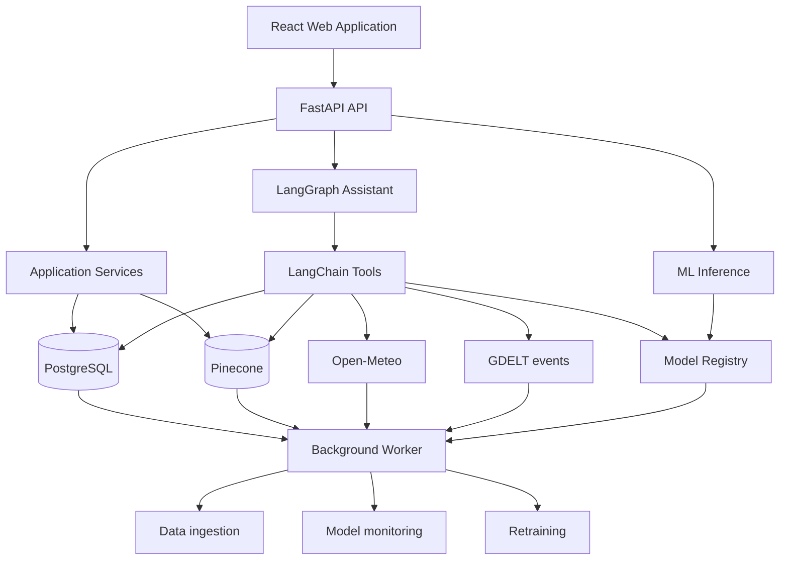

### 5.2 Component responsibilities

The React application renders the eight feature screens and communicates only with the FastAPI API. FastAPI is the HTTP boundary, exposing one router per feature and delegating to application services, the assistant graph, and ML inference. Application services implement feature use-cases over PostgreSQL and Pinecone; no ML or LLM logic leaks into serving code beyond loading saved artifacts. The LangGraph assistant orchestrates the typed tools into grounded answers (§5.4). ML inference loads the saved champion pipeline and returns delay probability and risk drivers. The background worker runs ingestion, monitoring, and retraining jobs via APScheduler or a scheduled command. The stores are PostgreSQL (operational data and snapshots), Pinecone (event and document vectors), and the model registry (versioned artifacts and metadata).

### 5.3 Agentic design: one coordinator

V1 is a single supply-chain coordinator using multiple typed tools inside a controlled LangGraph workflow. This is an agentic workflow, not a multi-agent system.

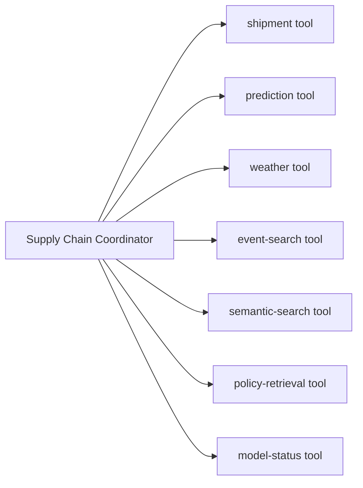

A genuine multi-agent version (a supervisor plus operations, risk, weather, event, and recommendation agents) would add latency, more LLM calls, higher cost, harder debugging and evaluation, duplicated work, unpredictable delegation, and more ways for the demonstration to fail. Multiple agents are warranted only when one agent has too many tools, needs specialized context, or must delegate genuinely separate work, none of which applies to V1.

Recommended external description of the assistant:

> SupplyMind V1 uses a single tool-using supply-chain coordinator orchestrated by LangGraph. The architecture supports future specialist agents, but V1 uses deterministic tool routing to maximize reliability, observability, and testability.

### 5.4 LangChain and LangGraph

The two are complementary. LangChain provides the components the application uses: model integration, tools, prompts, structured output, retrievers, embeddings, and vector-store connectors. LangGraph provides the engine that controls how those components execute: workflow nodes, shared state, conditional routing, loops, persistence, retries, and final response assembly. In SupplyMind, LangChain supplies the tools, retriever, LLM, prompts, structured outputs, and Pinecone integration; LangGraph supplies request routing, tool execution order, shared assistant state, conditional branches, retries, and final response assembly.

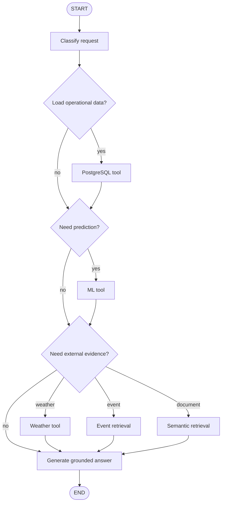

### 5.5 Assistant tools

`get_shipment`, `list_risky_shipments`, `predict_delay`, `search_events`, `get_weather`, `semantic_search`, `retrieve_policy`, `get_model_status`.

Each tool resolves to exactly one backing store or service, which keeps routing deterministic and testable.

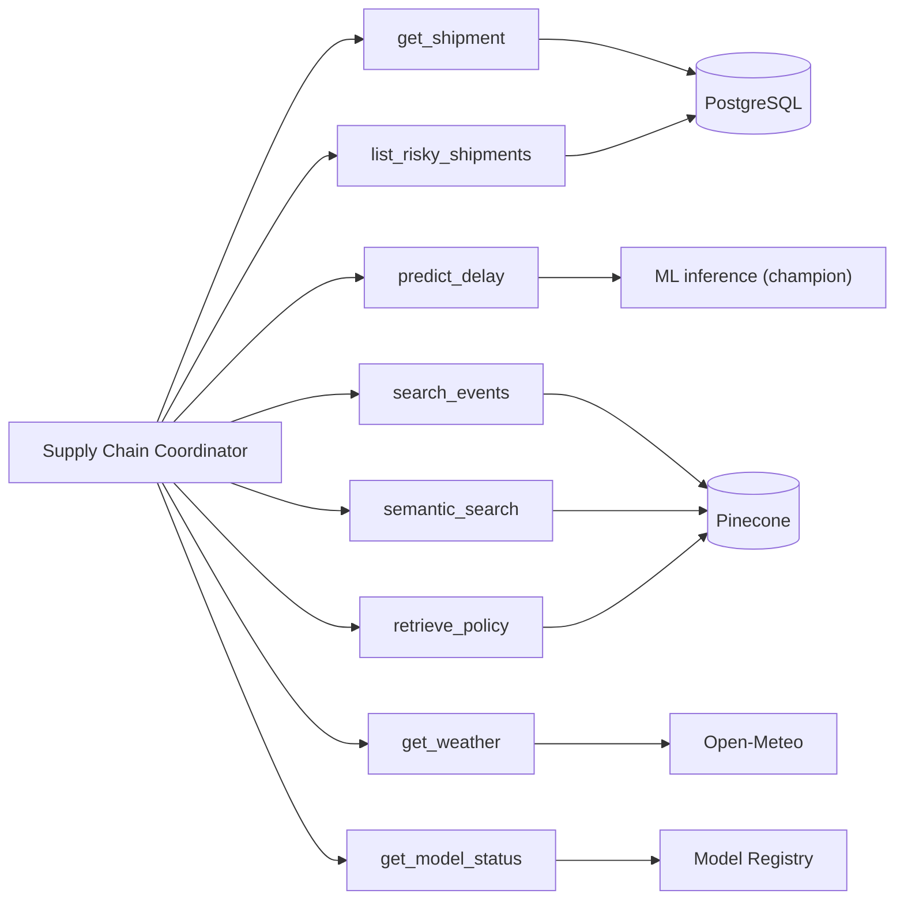

### 5.6 Prediction request flow

Scoring a shipment follows a fixed path from the API to the persisted champion pipeline and back, including the SHAP risk drivers surfaced in the shipment detail view.

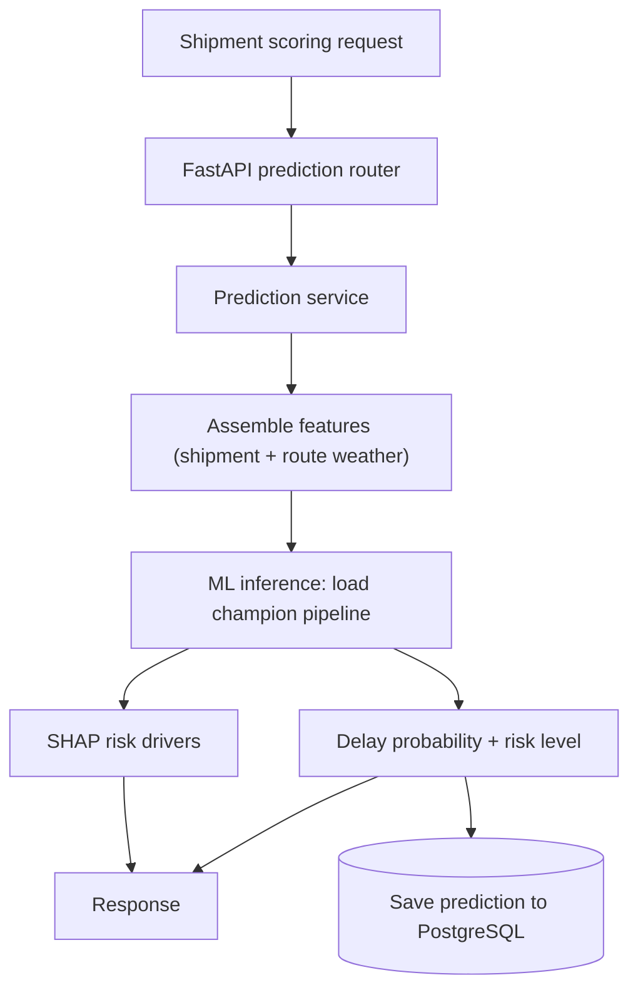

## 6. Data

### 6.1 Core dataset: SynDelay

SynDelay (Supply Chain Data Hub) is the core shipment-delay dataset. It is purpose-built for delivery-delay prediction, generated from patterns learned from real-world data, and published as a privacy-preserving benchmark that frames the task as early, on-time, or delayed. It is recent, benchmarkable, and supports train/validation/test comparison as well as binary or multi-class classification. V1 uses the binary target (D19).

SynDelay is synthetic, not raw company ERP data, and must be described precisely:

> The V1 model uses a synthetic, privacy-preserving delivery dataset modelled on real operational patterns because public shipment-level ERP data is scarce.

Synthetic data must not be presented as real ERP data.

| Aspect | Real ERP data | Synthetic data |
|---|---|---|
| Origin | Actual company system (SAP, Oracle, Dynamics, Odoo) | Artificially generated |
| Privacy | Often sensitive | Safer |
| Realism | Highest when clean | Depends on generator quality |
| Availability | Hard to obtain | Easier |
| Bias and errors | Reflects real operations | May miss real-world complexity |
| Best use | Production and validation | Prototyping, demonstrations, research |

Representative records:

```
ERP-style:  {order_id, supplier_id, product_id, warehouse_id,
             planned_delivery_date, actual_delivery_date, shipping_mode, quantity}

Synthetic:  {order_id, supplier_id, planned_lead_time_days,
             actual_lead_time_days, weather_severity, delayed}
```

LaDe (10M+ real-world last-mile records) is reserved for future work in route optimization, courier performance, ETA prediction, and last-mile analytics. It is too broad and heavy for V1.

### 6.2 Canonical schema strategy

Product logic is not tied to one dataset. Both V1 and future integrations map into the same canonical internal schema:

```
V1:     Synthetic / public ERP-like data  ->  canonical internal schema
Later:  SAP / Oracle / Dynamics connectors ->  canonical internal schema
```

### 6.3 External data

**Weather (Open-Meteo, required).** Provides current forecast, historical weather, and archived forecasts. Training uses archived historical forecasts; observed weather that became known after prediction time causes leakage.

Tool signature:

```
get_route_weather(origin: Location,
                  destination: Location,
                  departure_at: datetime,
                  expected_arrival_at: datetime) -> RouteWeather
```

Features: precipitation, snowfall, wind speed, wind gust, temperature, weather code, severe-weather indicator, origin severity, and destination severity. Responsibilities: fetch current or forecast weather for nodes, retrieve historical weather for enrichment, convert measurements into risk features, expose details to the assistant, generate weather events for the map, and associate severe weather with shipments.

**Events (GDELT).** A single, consistent global-event source feeds ingestion and structured extraction.

**RAG documents (simulated enterprise documents, clearly marked as simulated).** Supplier SLA documents, escalation policy, severe-weather operating procedure, delayed-shipment playbook, carrier-management policy, and incident reports.

### 6.4 Key data schemas

Event object:

```json
{
  "event_id": "EVT-102",
  "event_type": "severe_weather",
  "title": "Severe storm near Rotterdam",
  "latitude": 51.92,
  "longitude": 4.48,
  "region": "Rotterdam",
  "country": "Netherlands",
  "severity": 0.87,
  "published_at": "2026-08-06T09:00:00Z",
  "source": "weather",
  "summary": "Strong wind and rainfall may disrupt road and port operations."
}
```

Monitoring snapshot:

```
monitoring_snapshots
├── model_version
├── evaluated_at
├── accuracy
├── precision
├── recall
├── f1
├── roc_auc
├── drift_score
├── sample_count
└── retraining_required
```

### 6.5 Data entities

Known V1 entities: shipments, predictions, events, monitoring_snapshots, retraining_jobs, model_registry entries, and documents (Pinecone-indexed). A full column-level ERD is deferred to the implementation phase and maintained alongside the Alembic migrations.

### 6.6 Ingestion pipeline

Worker jobs pull from the four sources, validate and normalize into the canonical schema, and land structured rows in PostgreSQL and vectors in Pinecone. Events pass through LLM structured extraction; documents are embedded before indexing.

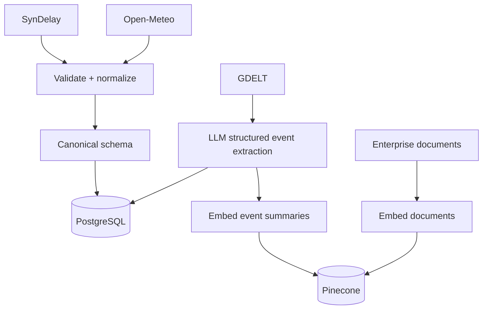

## 7. Machine learning

### 7.1 Task

Binary delay prediction (delayed / not delayed) for V1 (D19). The selection metric emphasizes recall and F1 because a missed delay is the costly error. A multi-class extension (early, on-time, slightly delayed, severely delayed) is a later roadmap item.

### 7.2 Models and selection

Compare Logistic Regression, Random Forest, and XGBoost, with HistGradientBoosting as an optional fourth candidate. Tune the leading candidate lightly on validation and evaluate once on the untouched test set. Persist preprocessing and model together with joblib.

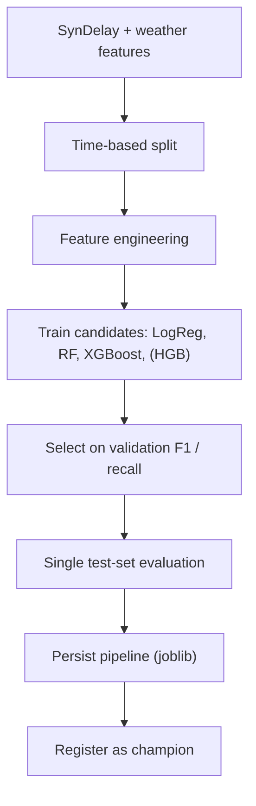

### 7.3 Leakage guardrails

Use a genuinely time-based split so future rows never train on past outcomes, and verify that the split is temporal. Train weather features on archived forecasts rather than post-hoc observed weather (§6.3). Before any model runs, inspect the target and every column for fields that would not exist at prediction time.

The data is partitioned along the time axis so each set only sees data from before the next set begins:

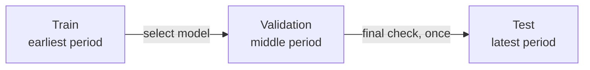

### 7.4 Explainability

SHAP surfaces per-shipment risk drivers in the shipment detail view, turning a probability into an explanation.

### 7.5 Retraining workflow

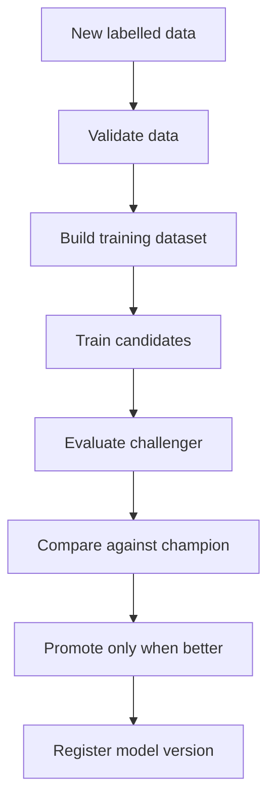

In V1 a historical holdout batch is retained and treated as newly-arrived data. The monitoring job runs, retraining is triggered, champion and challenger are compared, and the retraining record is saved. This is presented explicitly as a simulation of the production workflow.

### 7.6 Monitoring

Batch monitoring snapshots (§6.4) power the metrics and charts on the Model Monitoring screen. V1 uses no Prometheus/Grafana or live-observability stack; Evidently is optional.

The monitoring snapshot closes the loop with retraining: a snapshot that breaches a drift or performance threshold triggers a challenger, which is promoted only if it beats the champion.

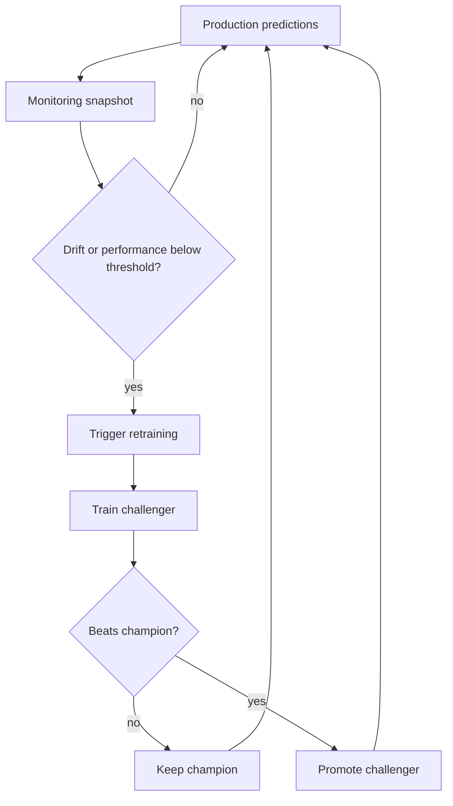

### 7.7 Scope boundaries: sentiment, clustering, and V1 alternatives

V1 deliberately includes only the techniques that solve a real supply-chain problem. Sentiment analysis and clustering are excluded so the project stays coherent rather than demonstrating every course topic.

| Technique | V1 |
|---|---|
| Sentiment analysis | No |
| Clustering | No |
| LLM structured event extraction | Yes |
| Semantic search | Yes |
| Binary delay classification | Yes |

Sentiment analysis is not load-bearing for delay prediction, so it earns no place in V1. Clustering is optional and introduces a separate analysis problem, including feature selection, scaling, algorithm choice, cluster validation, and meaningful business interpretation; in a six-to-seven-day build that would dilute the main project.

Where those techniques might otherwise have been used, V1 relies on simpler, more reliable mechanisms. Event deduplication uses deterministic rules rather than clustering: matching on the same source URL, a similar title, the same region, the same event type, and publication timestamps within a chosen window. Supplier and shipment segmentation uses ordinary filters and aggregations over PostgreSQL. Semantic similarity uses Pinecone embedding-based retrieval, which is not clustering but covers the V1 requirement of finding related documents and events.

The engineering story is stronger for it: each technique in V1 exists because it solves a real supply-chain problem, not because it appeared in the curriculum.

## 8. Technology and resources

| Layer | Choices |
|---|---|
| Frontend | React, TypeScript, Vite, Tailwind CSS, TanStack Query, React Router, Recharts, Leaflet |
| Backend | Python 3.12, FastAPI, Pydantic, SQLAlchemy, Alembic, PostgreSQL driver, HTTPX |
| AI | LangChain, LangGraph, OpenAI, structured-output schemas, Pinecone, embedding model, LangSmith tracing |
| ML | pandas, scikit-learn, XGBoost, joblib, SHAP, Evidently (optional); models: Logistic Regression, Random Forest, XGBoost, HistGradientBoosting (optional) |
| Data | SynDelay, Open-Meteo, GDELT, simulated enterprise policies, PostgreSQL, Pinecone |
| Automation (V1) | APScheduler or a scheduled worker command, FastAPI background tasks for very short operations only, Docker Compose |
| Automation (later) | Celery or Dramatiq, Redis, Prefect or Dagster |
| Deployment | Frontend on Vercel; API and worker on Railway; PostgreSQL on Supabase (Railway acceptable); vectors on Pinecone; images in GitHub Container Registry |

## 9. Repository structure

The structure below is the authoritative feature-first modular monorepo. It combines deployable applications, feature-based frontend modules, clean backend layers, shared capabilities, and ML and AI modules, and supersedes the earlier layer-first tree.

Do not scaffold empty folders on day one. Start with the V1 feature modules only (dashboard, assistant, shipments, predictions, event_monitor, semantic_search, model_monitoring, retraining, settings) and create subfolders only when code belongs in them.

```
supplymind-ai/
├── apps/
│   ├── web/                                # React + TypeScript + Vite (deployable)
│   │   ├── src/
│   │   │   ├── app/
│   │   │   │   ├── router/
│   │   │   │   ├── providers/
│   │   │   │   ├── layouts/
│   │   │   │   └── config/
│   │   │   ├── features/
│   │   │   │   ├── dashboard/
│   │   │   │   │   ├── api/
│   │   │   │   │   ├── components/
│   │   │   │   │   ├── hooks/
│   │   │   │   │   ├── pages/
│   │   │   │   │   ├── types/
│   │   │   │   │   └── index.ts
│   │   │   │   ├── assistant/
│   │   │   │   │   ├── api/
│   │   │   │   │   ├── components/
│   │   │   │   │   ├── hooks/
│   │   │   │   │   ├── pages/
│   │   │   │   │   ├── types/
│   │   │   │   │   └── index.ts
│   │   │   │   ├── shipments/
│   │   │   │   │   ├── api/
│   │   │   │   │   ├── components/
│   │   │   │   │   ├── hooks/
│   │   │   │   │   ├── pages/
│   │   │   │   │   ├── types/
│   │   │   │   │   └── index.ts
│   │   │   │   ├── predictions/
│   │   │   │   │   ├── api/
│   │   │   │   │   ├── components/
│   │   │   │   │   ├── hooks/
│   │   │   │   │   ├── pages/
│   │   │   │   │   ├── types/
│   │   │   │   │   └── index.ts
│   │   │   │   ├── event-monitor/
│   │   │   │   │   ├── api/
│   │   │   │   │   ├── components/
│   │   │   │   │   ├── hooks/
│   │   │   │   │   ├── pages/
│   │   │   │   │   ├── map/
│   │   │   │   │   ├── types/
│   │   │   │   │   └── index.ts
│   │   │   │   ├── semantic-search/
│   │   │   │   │   ├── api/
│   │   │   │   │   ├── components/
│   │   │   │   │   ├── hooks/
│   │   │   │   │   ├── pages/
│   │   │   │   │   ├── types/
│   │   │   │   │   └── index.ts
│   │   │   │   ├── model-monitoring/
│   │   │   │   │   ├── api/
│   │   │   │   │   ├── components/
│   │   │   │   │   ├── hooks/
│   │   │   │   │   ├── pages/
│   │   │   │   │   ├── charts/
│   │   │   │   │   ├── types/
│   │   │   │   │   └── index.ts
│   │   │   │   ├── retraining/
│   │   │   │   │   ├── api/
│   │   │   │   │   ├── components/
│   │   │   │   │   ├── hooks/
│   │   │   │   │   ├── pages/
│   │   │   │   │   ├── types/
│   │   │   │   │   └── index.ts
│   │   │   │   └── settings/
│   │   │   │       ├── api/
│   │   │   │       ├── components/
│   │   │   │       ├── pages/
│   │   │   │       ├── types/
│   │   │   │       └── index.ts
│   │   │   ├── shared/
│   │   │   │   ├── components/
│   │   │   │   ├── hooks/
│   │   │   │   ├── lib/
│   │   │   │   ├── types/
│   │   │   │   └── styles/
│   │   │   └── main.tsx
│   │   └── Dockerfile
│   ├── api/                                # FastAPI (deployable)
│   │   ├── src/
│   │   │   └── supplymind_api/
│   │   │       ├── main.py
│   │   │       ├── dependencies.py
│   │   │       ├── routers/
│   │   │       │   ├── dashboard.py
│   │   │       │   ├── assistant.py
│   │   │       │   ├── shipments.py
│   │   │       │   ├── predictions.py
│   │   │       │   ├── events.py
│   │   │       │   ├── semantic_search.py
│   │   │       │   ├── monitoring.py
│   │   │       │   ├── retraining.py
│   │   │       │   └── settings.py
│   │   │       └── schemas/
│   │   └── Dockerfile
│   └── worker/                             # Background jobs (deployable)
│       ├── src/
│       │   └── supplymind_worker/
│       │       ├── main.py
│       │       └── jobs/
│       │           ├── ingest_shipments.py
│       │           ├── ingest_weather.py
│       │           ├── ingest_events.py
│       │           ├── index_documents.py
│       │           ├── evaluate_model.py
│       │           └── retrain_model.py
│       └── Dockerfile
├── src/
│   └── supplymind/                         # Shared business core (feature-first + clean layers)
│       ├── features/
│       │   ├── dashboard/
│       │   │   ├── application/
│       │   │   └── domain/
│       │   ├── assistant/
│       │   │   ├── application/
│       │   │   ├── domain/
│       │   │   └── ai/
│       │   ├── shipments/
│       │   │   ├── application/
│       │   │   └── domain/
│       │   ├── predictions/
│       │   │   ├── application/
│       │   │   ├── domain/
│       │   │   └── ml/
│       │   ├── event_monitor/
│       │   │   ├── application/
│       │   │   ├── domain/
│       │   │   └── integrations/
│       │   ├── semantic_search/
│       │   │   ├── application/
│       │   │   ├── domain/
│       │   │   └── retrieval/
│       │   ├── model_monitoring/
│       │   │   ├── application/
│       │   │   ├── domain/
│       │   │   └── monitoring/
│       │   ├── retraining/
│       │   │   ├── application/
│       │   │   ├── domain/
│       │   │   └── pipeline/
│       │   └── settings/
│       │       ├── application/
│       │       └── domain/
│       ├── shared/
│       │   ├── domain/
│       │   ├── application/
│       │   │   └── ports/
│       │   ├── infrastructure/
│       │   │   ├── postgres/
│       │   │   ├── pinecone/
│       │   │   ├── weather/
│       │   │   ├── events/
│       │   │   ├── llm/
│       │   │   └── model_registry/
│       │   └── schemas/
│       └── ai_orchestration/
│           ├── graph/                      # LangGraph nodes and wiring
│           ├── tools/                      # LangChain typed tools
│           ├── prompts/
│           └── state/
├── data/
│   ├── raw/
│   ├── processed/
│   ├── sample/
│   └── documents/
├── models/
├── scripts/
│   ├── seed_database.py
│   ├── ingest_weather.py
│   ├── ingest_events.py
│   ├── train_models.py
│   ├── run_monitoring.py
│   └── simulate_retraining.py
├── tests/
│   ├── unit/
│   ├── integration/
│   ├── ml/
│   └── ai_evaluation/
├── migrations/
├── infra/
├── docker-compose.yml
├── pyproject.toml
├── Makefile
├── .env.example
└── README.md
```

A layer-first tree (`domain/`, `application/`, `infrastructure/`, `ml/`, `ai/`) is clean but scatters a single feature across many folders as the product grows. The feature-first layout keeps product-oriented ownership while preserving clean-architecture boundaries inside each feature, for example `features/predictions/{domain, application, ml}`.

## 10. Deployment

The frontend is deployed to Vercel. The API and worker are deployed to Railway. PostgreSQL is hosted on Supabase, with Railway as an acceptable alternative. Vectors are stored in Pinecone, and container images are published to the GitHub Container Registry. Deployment happens only after the local end-to-end flow is stable; no infrastructure rewrite is undertaken late in the build.

## 11. Roadmap

The following capabilities are explicitly post-V1.

**V1.1.** Authentication, user roles, saved assistant conversations, CSV upload, manual document upload, notification center, richer map filters, and model-threshold configuration.

**V1.2.** Supplier-risk model, supplier profile page, carrier-performance scoring, contract-aware supplier recommendations, Slack and email alerts, and automatic document re-indexing.

**V2.** Demand forecasting, inventory-shortage prediction, warehouse dashboard, purchase-order intelligence, scenario simulation, stock recommendation, and forecast confidence intervals. Binary delay classification remains through V2.

**V3.** Route optimization, live GPS tracking, port and customs intelligence, multimodal transport support, alternative-route recommendations, estimated-delay-duration regression (using LaDe), and the multi-class delay target (early, on-time, slightly delayed, severely delayed).

**V4.** Genuine multi-agent architecture with specialist weather, supplier-intelligence, operations, and planning agents; human-approval workflows; and agent evaluation and governance.

**Production platform.** Multi-tenancy, ERP connectors (SAP, Oracle, Dynamics), WMS/TMS integrations, SSO, audit logs, enterprise permissions, data-retention policies, encryption and secrets management, billing, customer-specific models, a feature store, streaming ingestion, and Kubernetes where justified.

**Analytical extensions (unversioned).** These are deferred from V1 (see §7.7). *Sentiment analysis:* supplier-news reputation monitoring, customer complaint analysis, and market or geopolitical narrative analysis; it is not load-bearing for delay prediction. *Clustering:* grouping similar disruption events, identifying shipment-risk patterns, segmenting suppliers by operational behaviour, grouping routes with similar delay characteristics, and deduplicating very similar news articles.

Mockup screens not in V1 map to releases as follows: Orders and Alerts to the V1.1 surface, Suppliers to V1.2, Inventory to V2, real-time shipment tracking to V3, and the multi-agent swarm to V4.

## 12. Delivery phases

The V1 build proceeds in seven phases across the build window. Each phase ends in a concrete, testable deliverable, and no phase begins before the previous deliverable is stable.

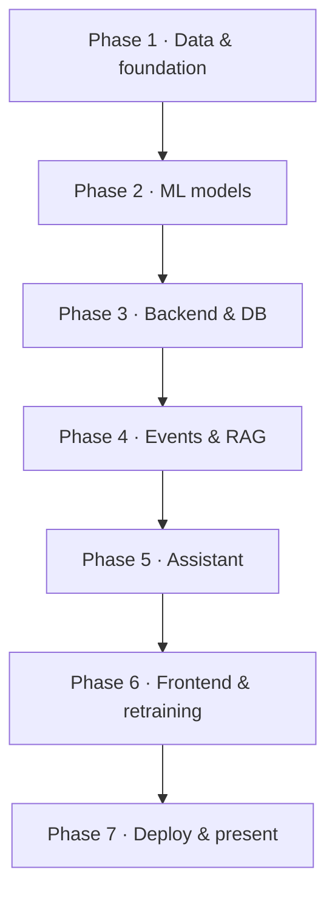

| Phase | Focus | Deliverable |
|---|---|---|
| 1 | Dataset selection, schema and leakage inspection, time-based split, ingestion and cleaning | Clean training dataset and confirmed architecture |
| 2 | Train and compare candidates, select on validation, single test evaluation, persist pipeline | Working delay-prediction model |
| 3 | FastAPI setup, PostgreSQL loading, shipment/prediction/model-status endpoints, basic tests | Operational API |
| 4 | Event ingestion, LLM structured extraction, embeddings, Pinecone upsert, retrieval test | Event-intelligence and RAG pipeline |
| 5 | LangGraph coordinator wiring the typed tools; grounded, evidence-based answers | Assistant answering shipment questions |
| 6 | Feature screens, retraining simulation, champion–challenger comparison | Complete end-to-end demo flow |
| 7 | Docker Compose, deploy frontend and API, seed demo data, README, fallback recording, rehearsal | Deployed, presentation-ready MVP |

## 13. Feasibility and risks

V1 is feasible within the build window only under these constraints: one ML target, one coordinator with no autonomous multi-agent system, no authentication, no route optimization, no demand forecasting, minimal map logic, a simulated production-retraining workflow, reusable frontend components, early data validation, and no late infrastructure rewrite. The finished product may display broader navigation, but only the eight V1 screens are presented as operational.

| Risk | Mitigation |
|---|---|
| Data quality and leakage (the primary risk, ahead of model training) | Inspect the target and columns first; enforce a genuinely time-based split; use archived weather forecasts (§7.3). |
| Multi-agent complexity | Use one coordinator with typed tools; describe tools as specialist capabilities rather than autonomous loops (§5.3). |
| External API instability (news, rate limits, deployment networking) | Cache events in PostgreSQL, seed demonstration events, and record a fallback demonstration. |
| Deployment time | Deploy only after the local end-to-end flow is stable. |

## 14. Appendix

**Glossary.** *Champion/challenger:* the deployed model versus a candidate; the candidate is promoted only if it wins. *Drift:* a change in data or label distribution that degrades performance. *RAG:* retrieval-augmented generation, grounding LLM answers in retrieved documents. *Agentic workflow versus multi-agent:* one model choosing tools along controlled paths versus several delegating agents.

**Primary references** (confirm exact URLs and licences before citing externally): SynDelay (Supply Chain Data Hub delivery-delay benchmark), LaDe (last-mile dataset, future), Open-Meteo (forecast and historical/archived), GDELT (global events), the LangChain and LangGraph documentation, and Pinecone.
